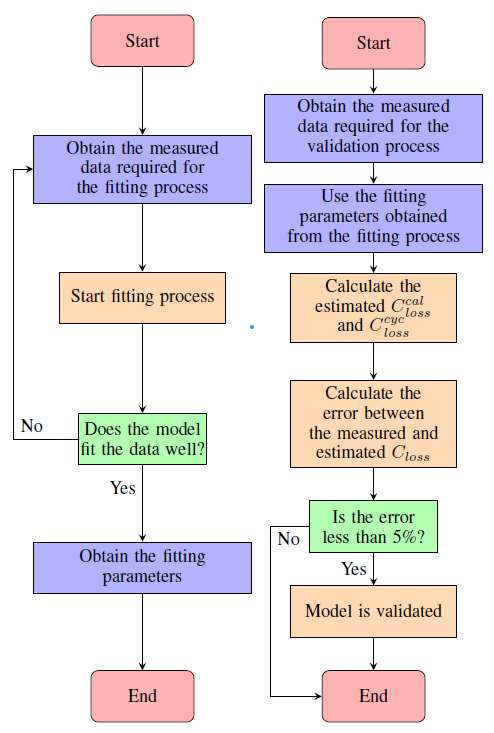
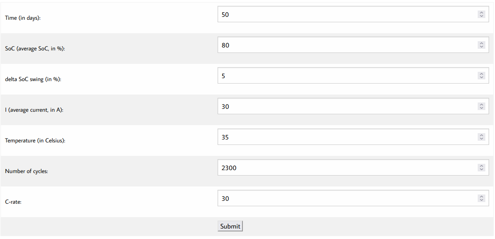
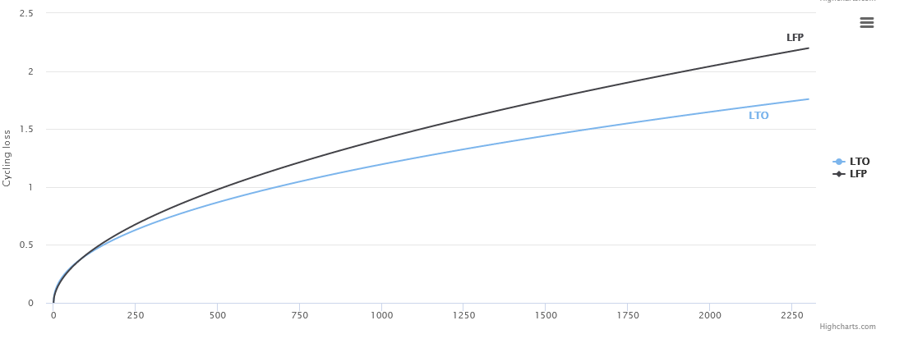

## CapacityLossMatlab
A Semi-Empirical Model (SEM) for predicting the capacity loss of Lithium-ion batteries (LIBs) during cycling aging is used. This project is published in 35th ECMS International Conference on Modelling and Simulation.

**This repository contains MATLAB files and data to predict the capacity loss using SEM**

**Main Contributor**: [Mohamed Rabah](https://scholar.google.com/citations?user=3o2gS80AAAAJ&hl=en)

**Affiliation**: Turku University of Applied Sciences

## Paper and conference presentation
[CAPACITY LOSS ESTIMATION FOR LI-ION BATTERIES BASED ON A SEMI-EMPIRICAL MODEL](https://drive.google.com/file/d/1_XF3AHhH7OotMk2cxfh0bj4TYo9XtvD7/view?usp=share_link) and [Presentation](https://drive.google.com/file/d/1Nuwq555htsr8aBe7mBM1xWdjWc5LwC5w/view?usp=share_link) contains the explanations of the utilized model and the used data. 

## Requirements
Tested on MATLAB 2021b, 2022a.

## Model explanation
### SEM equation explanation
To test the feasibility of the proposed model, several LIB chemistries should be evaluated. In this work, two different chemistries of LIBs have been chosen; Lithium Iron Phosphate (LFP) and Lithium-Titanate Oxide (LTO). These chemistries are among the primary candidates for modern heavy-duty battery electric vehicles (HDBEV) systems.

The general equation used to estimate the  capacity loss $C{^{cyc}_{loss}}$ is as follow: 

$$C{^{cyc}_{loss}} = B_{cyc}(I)\cdot e^{-\frac{E + \alpha \cdot |I|}{R(T-T_{ref})}} \cdot A{^{z_{cyc}}_h}$$

For Cycling  Aging, the $C_{loss}$ is mainly affected by current $I$, $T$ and number of cycles $N$. Furthermore, other parameters do have a margin effect depending on the temperature of the LIB, e.g. depth of discharge $DoD$, and the rated capacity. $B_{cyc}$ is a pre-exponential factor which depends on cycling current $I$, $\alpha$ and $z_{cyc}$ are the fitting coefficients, and $A_h$ is the full used capacity that can be obtained using the following equation:

$$A_h = FCE \cdot C_r = N \cdot DoD \cdot C_r$$

Where $FCE$ is the full cycle equivalent, $C_r$ is the rated capacity.

### Model identification
The process of model identification is divided into two parts; (a) Data Selection and Fitting, and (b) Model Validation. Data selection and fitting process is used to identify the following parameters $$E, _{cyc}, _{cyc}, \alpha, R$$ The .m files to identify these parameters will be added later to this repository. For now, data validation would be our main focus for now. 



## Model validation
Three .mat files are used to validate our model. All three files containes the time, SoC, current I, and temperature. These data files are measure in 25c. Feel free to change the temperature, as the model is trained to estimate the $C{^{cyc}_{loss}}$ under diffrent degrees.

**Datasw1.mat** : This is a data with median SoC = 15%, and SoC swing range = 5%

**Datasw2.mat** : This is a data with median SoC = 50%, and SoC swing range = 45%

**simulateddata.mat** : This is a data from a simulated duty cycle for a Mining Dumper.

## How to run the file
The calculation of the SEM is implemented in **semi_empirical_model.m**. 

Run **capacity_loss.m**. load the **Datasw1.mat**. The required information should be filled in the file as following:
````
Data.time - time [s]
Data.SoC- battery state of charge from 0 to 1 [-]
Data.I - battery current [A]
Data.T - battery temperature [K]
C_n - rated capacity [Ah]
N - number of the cycle repetitions % change this to see how much impact it have on the total loss
batt - Li-ion battery chemistry 
period - minimum storage period when calendar aging is considered [days]. This can be added as zero for now
````
     
Run the script file, and you should have the total loss during cycling aging printed out
````
Total loss of the capacity  percents.
Total loss of the capacity during cycling aging 1.22485 percents.
````

## Some results
**Requried info:**
````
Data.time=Datasw.time;
Data.SoC=(Datasw.SoC)/100;
Data.I=Datasw.I;
Data.T=Datasw.T+273.15+10; %Add 10 if you want to test in 35c 
C_n=30;
batt='LFP';
N=1000;
period=0;
````

**Output:**
````
Total loss of the capacity during cycling aging 8.85143 percents.
````

## Offline prediction showcase
Go to this [link](https://comea.turkuamk.fi/battery-aging-showcase/)
Add the required information and check your results as the below images




